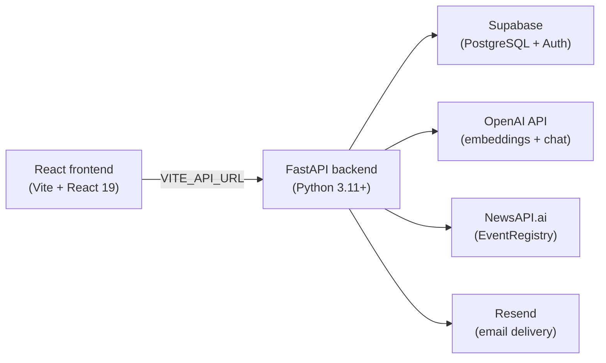

Quorent is designed to be fully self-hostable. You own the deployment, the data, and the API keys. The stack is intentionally straightforward: a Python FastAPI backend, a Vite + React frontend, and Supabase handling both authentication and the database. Three external services — OpenAI, NewsAPI.ai (EventRegistry), and Resend — provide the AI, news data, and email delivery respectively.

## Architecture

The frontend communicates exclusively with the FastAPI backend over HTTP. The backend in turn talks to Supabase for all persistence and auth, calls OpenAI to generate embeddings and chat responses, pulls articles from NewsAPI.ai via EventRegistry, and sends email digests through Resend.

## Required external services

Before starting, make sure you have accounts and API keys for the following services.

| Service | Purpose | Where to sign up |
|---|---|---|
| Supabase | PostgreSQL database, auth, and vector storage | supabase.com |
| OpenAI | Embeddings (`text-embedding-*`) and chat completions | platform.openai.com |
| NewsAPI.ai / EventRegistry | Article fetching and concept extraction | newsapi.ai |
| Resend | Transactional email for daily digests | resend.com |

<Info>
  Supabase must have the `pgvector` extension enabled. It is available on all Supabase projects by default. The `match_articles` RPC function used for semantic search depends on it.
</Info>

## Setup steps

Work through the following pages in order to get a running instance.

<CardGroup cols={2}>
  <Card title="Backend setup" icon="server" href="/self-hosting/backend-setup">
    Install Python dependencies, configure environment variables, and run the FastAPI server with uvicorn or gunicorn.
  </Card>
  <Card title="Frontend setup" icon="browser" href="/self-hosting/frontend-setup">
    Install Node dependencies, point the frontend at your backend, and build or deploy with Vite.
  </Card>
  <Card title="Environment variables" icon="key" href="/self-hosting/environment-variables">
    Full reference for every backend and frontend environment variable, including where to obtain each value.
  </Card>
  <Card title="Database setup" icon="database" href="/self-hosting/database">
    Create the required Supabase tables, enable Row Level Security, and register the vector search function.
  </Card>
</CardGroup>
